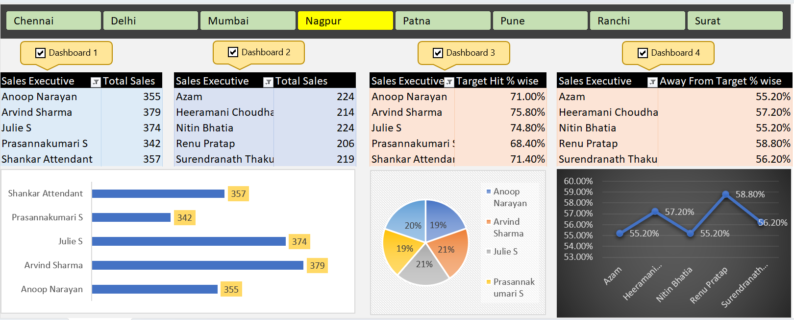
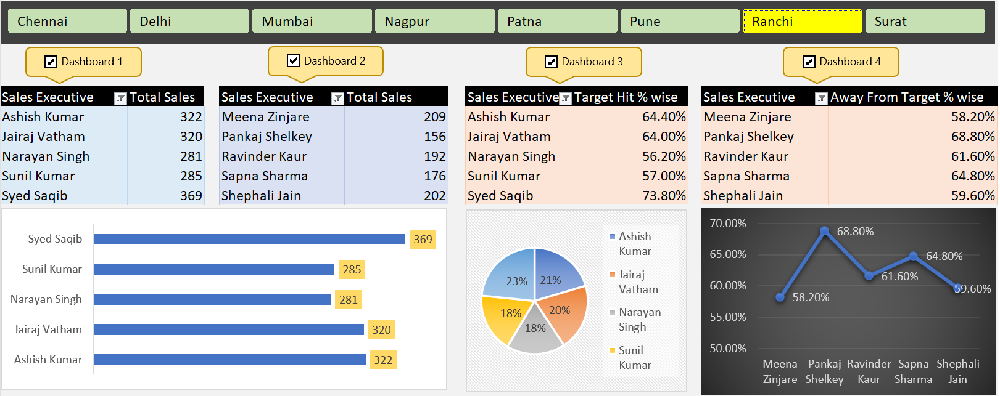

# Interactive Excel Sales Dashboard

An interactive Excel dashboard developed as a hands-on data analytics practice project to analyze and visualize sales performance using Microsoft Excel.

## Project Overview

This project demonstrates how Excel can be used to transform raw sales data into an interactive dashboard for exploring business performance.

The dashboard combines PivotTables, PivotCharts, slicers, Excel formulas, and VBA automation to provide dynamic analysis and region-based filtering.

## Key Features

- Interactive region-based filtering using slicers
- Multiple dashboard views for sales analysis
- PivotTables for summarizing sales data
- PivotCharts for visual data representation
- Sales performance analysis
- Target achievement analysis
- Away-from-target percentage analysis
- VBA-based slicer and dashboard automation
- Dashboard design and formatting

## Tools & Skills

- Microsoft Excel
- PivotTables
- PivotCharts
- Slicers
- Excel Formulas
- VBA / Macros
- Data Analysis
- Data Visualization
- Dashboard Design

## Dashboard Preview

### Dashboard Overview

### Dashboard with Region Filter

## What I Practiced

Through this project, I practiced:

- Creating and working with PivotTables
- Building interactive PivotCharts
- Connecting slicers with multiple PivotTables
- Creating interactive Excel dashboards
- Applying formulas for data analysis
- Using VBA to automate dashboard interactions
- Presenting sales data through meaningful visualizations

## Learning Context

This project was completed as part of hands-on Excel learning and practice. It provided practical experience in dashboard creation, data analysis, visualization, and basic VBA automation.

## File Format

The main workbook is provided in `.xlsm` format because it contains VBA macros.

Microsoft Excel desktop may be required for the VBA-based interactive features to work correctly.
